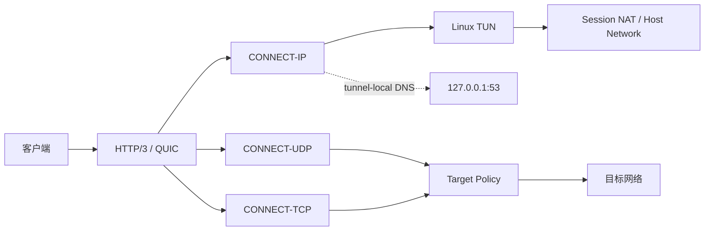

# jiejie-masque

> 一个面向 Linux 的统一 MASQUE 服务端，在单一静态二进制中提供
> CONNECT-IP、CONNECT-UDP 与 CONNECT-TCP，重点关注协议正确性、可控内存、
> 生命周期安全和长期可维护性。

The current maintenance release is `v1.0.11`.
当前正式维护版本：v1.0.11。

## 项目简介

jiejie-masque 是一个自托管 Linux MASQUE 服务端。它有两个独立的运行模式：

- `connect-ip`：MetaCubeX/Mihomo CONNECT-IP、Linux TUN、P-256 客户端认证、Session NAT、DNS gateway 和 systemd 生命周期管理。
- `connect-udp`：RFC 9298 CONNECT-UDP、HTTP/3 DATAGRAM、UDP relay、HTTP Basic authentication，以及普通 HTTP/3 CONNECT TCP relay。

因此，项目能力覆盖三类 MASQUE 使用场景：CONNECT-IP、CONNECT-UDP 和 CONNECT-TCP；但实际服务进程是两个独立 mode，而不是三个独立 daemon。

项目提供单一静态 Linux amd64 binary。配置、客户端节点生成、systemd unit、network prepare、健康检查和 release artifact 验证位于同一个工程中。

## 为什么做这个项目？

MASQUE 生态中已经有多个优秀实现。本项目不是为了替代它们，而是针对自己的长期服务器使用场景，把 CONNECT-IP、CONNECT-UDP、CONNECT-TCP、Linux network preparation、DNS、Session NAT、健康检查和发布验证整合成一套更容易维护的服务端。

项目更重视以下工程约束：协议 correctness、清晰的 ownership、bounded memory、Linux 长期运行、单一 binary 和可审计的 release provenance。

## 项目特点

### 一个二进制，两个运行模式

CONNECT-IP 适合需要 TUN 和虚拟地址的场景；CONNECT-UDP 适合无需 TUN 的 UDP/TCP relay 场景。两者使用独立 YAML 和独立 systemd service。

### 面向 Linux 长期运行

CONNECT-IP 组合了 TUN、可选 Session NAT、network prepare、systemd `Type=notify`、watchdog 和 host-network deep probe。CONNECT-UDP 不需要 `CAP_NET_ADMIN`。

### 明确的资源与 ownership 规则

QUIC DATAGRAM、HTTP/3 stream DATAGRAM、CONNECT-IP session queue 和 CONNECT-UDP flow 都有明确上限。owned buffer 的 `Release`、队列关闭和 cleanup 生命周期由测试覆盖。

### 减少不必要的复制，但不营销“完全零拷贝”

正常 CONNECT-IP/CONNECT-UDP 路径在最终 QUIC serialization 前尽量避免完整 payload copy；`DatagramFrame.Append` 保留一次 intentional serialization copy，以配合 AEAD、header protection、连续 QUIC packet backing 和 GSO。

### tunnel-local DNS

CONNECT-IP 默认在 tunnel address 的 `:5353` 提供 UDP/TCP DNS gateway，只转发到 VPS 本机 `127.0.0.1:53`，不会开放公共 DNS resolver。生成的 Mihomo 节点会启用 `remote-dns-resolve` 并使用该 tunnel DNS 地址。

### 目标地址安全策略

CONNECT-UDP/CONNECT-TCP 默认只允许 public、globally reachable unicast destination。hostname 只解析一次，地址先经过 policy 检查，再以 validated numeric IP 建立连接，从而降低 DNS rebinding 和 special-purpose address 风险。

### 可验证的发布链

正式 release 使用 annotated semver tag；CI build once，release job 下载并发布同一个 artifact，不重新 build。`RELEASE.txt`、SHA256、remote digest 和 byte comparison 都参与验证。

## 架构概览



## 快速开始

### 1. 下载并安装

从 [GitHub Releases](https://github.com/Piggy-Cat-bit-shadow/jiejie-masque-unified/releases) 下载 Linux amd64 binary，核对 release 页面上的 checksum 后安装：

```sh
chmod +x jiejie-masque-linux-amd64
sudo install -m 755 jiejie-masque-linux-amd64 /usr/local/bin/jiejie-masque
```

### 2. 选择配置文件

复制实际 example，再按部署环境修改：

```sh
sudo install -d -m 700 /etc/jiejie-masque
sudo install -m 600 configs/connect-ip.example.yaml /etc/jiejie-masque/connect-ip.yaml
sudo install -m 600 configs/connect-udp.example.yaml /etc/jiejie-masque/connect-udp.yaml
```

配置必须先通过：

```sh
jiejie-masque check-config --config /etc/jiejie-masque/connect-ip.yaml
jiejie-masque check-config --config /etc/jiejie-masque/connect-udp.yaml
```

### 3. 生成密钥和客户端节点

```sh
jiejie-masque keygen
jiejie-masque server-keygen \
  --cert /etc/jiejie-masque/connect-ip/server.crt \
  --key /etc/jiejie-masque/connect-ip/server.key
jiejie-masque mihomo-config \
  --config /etc/jiejie-masque/connect-ip.yaml \
  --server vpn.example.com \
  --port 443 \
  --private-key BASE64_KEY
```

`mihomo-config` 的 `--private-key` 只接受明确传入的 P-256 ECDSA key。详细字段说明见 [中文运维手册](docs/OPERATIONS.md)。

### 4. 直接运行或使用 systemd

开发验证可以直接运行：

```sh
jiejie-masque serve --config /etc/jiejie-masque/connect-udp.yaml
```

生产部署建议使用仓库中的 `contrib/jiejie-masque-connect-ip.service` 或 `contrib/jiejie-masque-connect-udp.service`，并先阅读 [docs/OPERATIONS.md](docs/OPERATIONS.md)。

## 客户端与配置提示

- CONNECT-IP 需要 Linux TUN、`CAP_NET_ADMIN`、IPv4 forwarding 和 network prepare。
- CONNECT-UDP 不需要 TUN 或 `CAP_NET_ADMIN`，公网部署必须保持认证开启。
- CONNECT-UDP 使用 `auth.users` 与 `password_env`，不要把密码直接提交到 YAML。
- CONNECT-IP client private key 是 SEC1 EC DER Base64；server endpoint public key 是 PKIX/SPKI DER Base64；client authentication public key 是 raw uncompressed P-256 point Base64，三者不要混用。
- Mihomo/MetaCubeX CONNECT-IP 是当前主要客户端路径。CONNECT-UDP 使用标准 HTTP Basic authentication 模型，Surge 等客户端兼容性应按真实客户端继续验证，不在此处夸大承诺。

## CONNECT-IP 部署时必须检查 Linux 防火墙

CONNECT-IP 与普通应用层 UDP/TCP proxy 不同：它会把客户端 IP packet 注入 Linux TUN。创建 TUN、开启 IPv4 forwarding 和配置 NAT 之后，还必须确认主机 firewall 允许对应的 `INPUT` / `FORWARD` 流量。

两类流量经过的 chain 不同：

- **Tunnel-local DNS**：`client → TUN (masque0) → tunnel gateway:5353`。目标是 VPS 自身的 tunnel address，属于 `INPUT`，需要允许从 TUN interface 到 tunnel gateway 的 UDP/TCP 5353。
- **普通 Internet 转发**：`client tunnel IP → TUN → Linux routing → WAN interface`。目标在外部网络，属于 `FORWARD`，需要允许从 TUN interface 到 WAN interface 的转发；NAT/MASQUERADE 不能替代这条 firewall rule。

因此，出现“UDP/443、QUIC/TLS、SNI routing 和 CONNECT-IP session 都正常，但网页、测速或 DNS timeout”时，应同时检查 TUN 的 `INPUT` 和 `FORWARD`，而不只检查 handshake、`ip_forward` 或 NAT。active UFW 环境下，network prepare 会按实际 tunnel/WAN/DNS 配置自动加入并维护最小权限规则；UFW inactive/missing 或 custom firewall 仍需管理员自行集成。请参阅 [运维手册中的防火墙示例](docs/OPERATIONS.md#8-connect-ip-linux-防火墙与-ufw)。

## 技术设计与优化

下面只保留设计摘要；需要深入实现细节时再展开。

<details>
<summary><strong>点击展开：CONNECT-IP 零拷贝、PacketPool、retained budget 与 TUN 路径</strong></summary>

CONNECT-IP receive path 使用 TUN 与 QUIC DATAGRAM 的 owned/borrowed 组合。retained receive budget 为 64，超出后使用 exact-size compact fallback copy。正常 application payload 不做完整复制；发送方向在最终 QUIC serialization 前也不做完整 payload copy。最终 `DatagramFrame.Append` 的一次 copy 是当前 AEAD、header protection、连续 packet backing 与 GSO 组合下的明确工程取舍。

</details>

<details>
<summary><strong>点击展开：CONNECT-UDP buffer-aware relay 与资源控制</strong></summary>

CONNECT-UDP 遵循 RFC 9298，使用 HTTP/3 DATAGRAM Context ID 0。target 到 client 使用 Proxy-level shared 1510-byte backing；1500-byte UDP payload 可以转发，1501-byte 或更大 datagram 使用 sentinel 检测并丢弃，不转发截断前缀。global/per-user flow limit、idle timeout、shutdown 和 exactly-once Release 均有边界。

</details>

<details>
<summary><strong>点击展开：CONNECT-TCP stream relay 与 half-close</strong></summary>

CONNECT-TCP 使用 stream relay 和 TargetPolicy。client request EOF 会对 target 执行 `CloseWrite`，但 response 方向继续读取；target response EOF 后再优雅关闭 HTTP/3 send side。这样保留 TCP half-close 语义。

</details>

<details>
<summary><strong>点击展开：QUIC / HTTP/3 队列与 retained budget</strong></summary>

当前冻结的主要上限为：QUIC DATAGRAM send queue 32、receive queue 128、HTTP/3 stream DATAGRAM queue 32、CONNECT-IP retained receive budget 64、CONNECT-IP outbound queue 默认 256。bounded queue 的目标是让 pressure 可观察、内存可控，而不是把无限 backlog 隐藏起来。

</details>

<details>
<summary><strong>点击展开：Linux Offload、GSO 与 GRO</strong></summary>

UDP GSO 保留；TUN offload 与 TCP TX GRO 默认关闭：`tun_offload: false`、`tun_tx_gro: false`。v1.0.10 修复了可选 TCP TX GRO 在吸收带 PSH 的 segment 后仍继续跨越 PSH 边界聚合的问题。

</details>

<details>
<summary><strong>点击展开：DNS gateway 与 TargetPolicy</strong></summary>

CONNECT-IP DNS gateway 同时支持 UDP/TCP，监听 tunnel address 的 5353 端口并转发到 `127.0.0.1:53`。UDP payload 上限为 4096 bytes；DNS-over-TCP 支持 sequential 与 pipelined query，并按顺序返回。CONNECT-UDP/CONNECT-TCP 默认只允许 globally reachable unicast，IPv4-mapped IPv6 会先 unmap，DNS 与 dial 共用默认 10 秒 establishment deadline。

</details>

<details>
<summary><strong>点击展开：Session NAT、cleanup 与未关闭的复现项</strong></summary>

Session NAT 使用 bounded two-worker cleanup executor。shadow address 在 cleanup pending 期间不可立即复用，`reuse_delay` 在 cleanup attempt 完成后才开始，包括 cleanup error。F-302/F-404 仍需要真实 Linux/VPS reproduction；文档不会把它们包装成已解决问题。

</details>

<details>
<summary><strong>点击展开：为什么主动保留最后一次 memcpy</strong></summary>

项目不是“没优化完”而是有意选择 `1 memcpy + GSO + clear ownership`。为了追求 0 copy 而引入 scatter crypto、更复杂的 backing lifetime、更多 syscall 或更难审计的 ownership，未必适合长期运行服务端。没有生产 profile、syscall、CPU、latency 和 packet-loss 证据时，不重新打开这条边界。

</details>

<details>
<summary><strong>点击展开：Release provenance</strong></summary>

正式 release 通过 annotated tag 触发。tag object、target commit、`GITHUB_SHA`、checked-out `HEAD` 和 GitHub API 对象相互校验；build job 只 build 一次，release job 只下载并发布同一 artifact。v1.0.4 至 v1.0.7 是历史 release-pipeline failure markers，不是正式 canonical release；v1.0.8 与 v1.0.9 的 provenance 记录保持不变。

</details>

## 配置与运维

- [中文运维手册](docs/OPERATIONS.md)：安装、配置、network prepare、systemd、DNS、升级、回滚与故障排查。
- [架构与性能边界](docs/architecture.md)：canonical queues、buffer ownership 和 frozen optimization boundary。
- [维护与 release guide](docs/maintenance.md)：开发期审计、依赖 provenance 和 release gate。
- [中文更新日志](CHANGELOG.md)：面向用户的版本演进摘要。

## 安全建议

- 配置文件和 EnvironmentFile 使用 `chmod 600`，private key 不要提交到 GitHub。
- CONNECT-UDP 公网服务必须启用 authentication，不要使用 unauthenticated mode。
- 不要把 DNS gateway 暴露到公网地址。
- CONNECT-IP client 会 pin server public key；升级时保留原有 P-256 server identity。
- `allow_private: true` 是明确的安全放宽，只在可信部署中使用。

## 升级、回滚与故障排查

升级前下载并核对新 binary 的 SHA256，备份当前 binary 和 config，运行 `check-config` 后再 restart。回滚时恢复上一个已验证 binary，重新检查配置并重启对应 service；不要自动修改用户配置，也不要无意替换 CONNECT-IP server certificate/private key。

常见排查方向：CONNECT-IP 能连接但网页打不开时检查 tunnel DNS、`127.0.0.1:53`、forwarding 和 NAT；完全无法建立时检查 UDP/443、防火墙、证书和 public key；CONNECT-UDP 返回 401 时检查 `password_env`；systemd 重启时查看 `journalctl -u SERVICE` 与 watchdog/deep probe 日志。

## 当前状态

- F-501：FIXED / RELEASED in v1.0.9。
- F-601：FIXED / RELEASED in v1.0.10。
- F-701：FIXED / RELEASED in v1.0.11。
- F-404：REPRODUCTION REQUIRED / NON-RELEASE-BLOCKING。
- v1.0.11：正式发布，未部署 production。
- 当前 core dataplane 保持冻结，暂不部署 production。

## 致谢

项目从 quic-go、connect-ip-go、MetaCubeX/Mihomo、MASQUE RFC/IETF 规范以及 WireGuard-go 的相关 Linux GRO 思路中获得了大量启发。感谢这些优秀实现和标准生态。

## License

请以仓库实际提供的 license 文件和上游依赖 license 为准。
