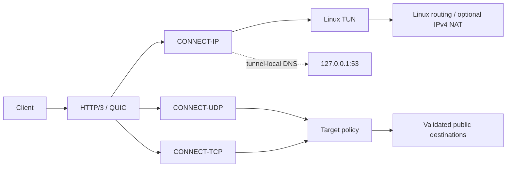

# jiejie-masque

The current maintenance release is `v1.0.16`.
当前正式维护版本：`v1.0.16`。

jiejie-masque 是面向 Linux 的统一 MASQUE 服务端，在单一静态 Linux amd64 二进制中提供 CONNECT-IP、CONNECT-UDP 和 CONNECT-TCP。项目强调协议正确性、可控资源、明确 ownership、长期运行稳定性和可验证发布链。

## 当前能力

- CONNECT-IP：P-256 客户端认证、Linux TUN、IPv4、IPv6、dual-stack、可选 IPv4 Session NAT、tunnel-local DNS gateway。
- CONNECT-UDP：RFC 9298 HTTP/3 DATAGRAM relay，支持 UDP authentication、target policy、flow idle timeout 和 bounded buffer。
- CONNECT-TCP：HTTP/3 stream relay，保留 TCP half-close 语义并使用同一 target policy。
- 运维：`check-config`、`doctor`、network prepare、systemd `Type=notify`、watchdog、deep probe 和 qlog。
- 客户端：可生成 Mihomo/MetaCubeX CONNECT-IP 节点配置，IPv4-only、IPv6-only 和 dual-stack 输出分别保持 family accurate。

## 架构与资源边界



主要 production boundaries：QUIC DATAGRAM send queue 512、receive queue 256、HTTP/3 stream DATAGRAM queue 256、CONNECT-IP outbound queue 默认 1024、retained receive budget 64。CONNECT-UDP payload 上限为 1500 bytes；flow、session、NAT cleanup 和 packet ownership 均为 bounded，并由测试覆盖 exactly-once release 与 shutdown 行为。

发送路径保留一次明确的 QUIC serialization copy，以换取 AEAD、header protection、连续 packet backing 和 GSO 组合下更简单、可审计的 ownership。没有 profile 证据时不重新打开这一边界。

生产拥塞控制默认使用 CUBIC。维护的 quic-go fork 提供 identity-free runtime diagnostics、QLOG 和队列压力统计；实验性 controller 不会自动成为生产默认值。

## IPv4、IPv6 与 dual-stack

IPv4-only、IPv6-only 和 dual-stack tunnel 都受配置与 doctor 检查。IPv6 tunnel MTU 必须至少为 1280；IPv4-only 可以使用不低于 576 的 MTU。

IPv6 tunnel connectivity 不等于 public IPv6 egress。默认不会为 IPv6 宣布 `::/0`；只有配置 `server.advertise_ipv6_default_route: true`，并且 tunnel prefix 是 routed public IPv6 prefix 时才会向客户端宣布 IPv6 default route。ULA/private IPv6 会被拒绝，不使用 NAT66 或伪造 PREF64 来掩盖缺少 IPv6 上游路由。

## 安装与运行

从 [GitHub Releases](https://github.com/Piggy-Cat-bit-shadow/jiejie-masque-unified/releases) 下载 v1.0.16 Linux amd64 binary，先校验 `.sha256`，再安装：

```sh
chmod +x jiejie-masque-linux-amd64
sha256sum -c jiejie-masque-linux-amd64.sha256
sudo install -m 755 jiejie-masque-linux-amd64 /usr/local/bin/jiejie-masque
```

复制对应 example 配置并设置 600 权限：

```sh
sudo install -d -m 700 /etc/jiejie-masque
sudo install -m 600 configs/connect-ip.example.yaml /etc/jiejie-masque/connect-ip.yaml
sudo install -m 600 configs/connect-udp.example.yaml /etc/jiejie-masque/connect-udp.yaml
jiejie-masque check-config --config /etc/jiejie-masque/connect-ip.yaml
jiejie-masque check-config --config /etc/jiejie-masque/connect-udp.yaml
```

首次部署先运行：

```sh
jiejie-masque doctor --config /etc/jiejie-masque/connect-ip.yaml
sudo /usr/local/libexec/jiejie-masque-connect-ip-network-prepare \
  /etc/jiejie-masque/connect-ip.yaml
```

network prepare 负责最小权限的 TUN、forwarding、route、NAT 和 active UFW 规则；custom firewall 仍需管理员自行接入。普通 Internet 转发需要 `FORWARD`，tunnel-local DNS 需要从 TUN 到 tunnel gateway:5353 的 `INPUT` 规则。

systemd unit 位于 `contrib/`。CONNECT-IP 使用 `CAP_NET_ADMIN`、`CAP_NET_BIND_SERVICE`、`CAP_NET_RAW` 和 `LogsDirectory=jiejie-masque`；CONNECT-UDP 不需要 TUN 管理能力。qlog 启用时，服务启动会验证目录可创建、可写，连接文件使用 0600，且不记录 client identity、target 或 tunnel address。

## 安全模型

- CONNECT-UDP/CONNECT-TCP 默认只允许 public、globally reachable、unicast destination。
- hostname 只解析一次，解析结果先经过 policy 检查，再以 validated numeric IP dial，降低 DNS rebinding 和 special-purpose address 风险。
- `allow_private: true` 是明确的安全放宽，只应在可信环境使用。
- Basic authentication 密码通过 environment 注入，不把 credential 写入 YAML、日志或 release artifact。
- CONNECT-IP client private key、server certificate/private key 和 public key 均不得提交到仓库。
- DNS gateway 只转发到 VPS 本机配置的 resolver，不作为公共 DNS 服务开放。

## 诊断与文档

- [运维手册](docs/OPERATIONS.md)：安装、配置、IPv6、systemd、network prepare、DNS、防火墙与故障排查。
- [架构说明](docs/architecture.md)：dataplane、queue、ownership、session 和 cleanup 边界。
- [QUIC / congestion 说明](docs/CONNECT_IP_QUIC_CONGESTION.md)：CUBIC 默认、runtime diagnostics、实验性能力和验证边界。
- [fork provenance](docs/FORKS.md)：当前维护 quic-go 与 connect-ip-go 来源及 pin。
- [维护规范](docs/maintenance.md)：当前 release、依赖、CI gates、release procedure 和限制。
- [当前 release notes](docs/RELEASE_NOTES_v1.0.16.md)：仅描述当前正式版本状态。

## 当前限制

- 生产默认仍为 CUBIC、`tun_offload: false`、`tun_tx_gro: false`；任何实验性 congestion controller、offload 或 PMTU ceiling 都需要独立 benchmark 和真实 WAN 验证。
- IPv6 public egress 依赖 VPS 的真实 routed prefix 和 upstream forwarding；本项目不会替部署环境伪造 IPv6 出口。
- Linux TUN、firewall、forwarding、NAT 和 DNS 上游仍依赖部署主机，loopback 或 netem 结果不能替代真实高 RTT、移动和 reordered path A/B。
- 真实 VPS 部署前必须保存 binary checksum，运行 `check-config`、`doctor` 和 network prepare，并从 systemd journal 验证 watchdog、deep probe 与 qlog 状态。

## License / acknowledgements

请以仓库实际提供的 license 文件及依赖 license 为准。本项目参考 quic-go、connect-ip-go、MetaCubeX/Mihomo、MASQUE RFC/IETF 规范和 WireGuard-go 的相关 Linux 网络实现。
